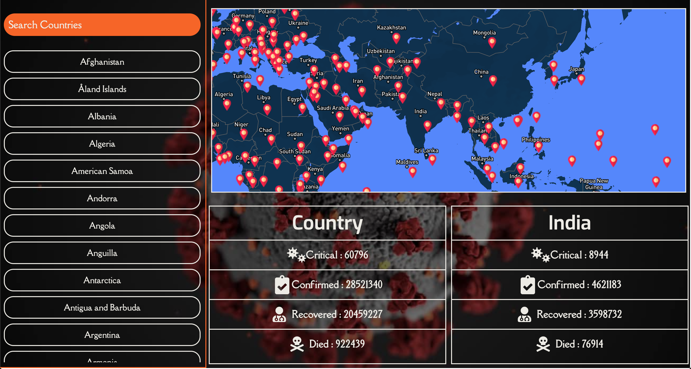

# Not A Odinary Covid Tracker 

## How to Run Locally

Clone the Repo and open Repo folder in terminal 

### `git clone https://github.com/heet-vakharia/NotAOridinaryCovidTracker.git`

### `cd NotAOridinaryCovidTracker`

Install Node Modules 

### `yarn`

OR

### `npm install`

### `yarn start`

Finally run 

### `yarn start`

OR

### `npm start`

web app would be open in the default browser 
If not , Open [http://localhost:3000](http://localhost:3000) to view it in the browser.
The page will reload if you make edits. 
You will also see any lint errors in the console.

## ShortCuts

Option/Alt + I : Focus on Input 
Option/Alt + - : Map Zoom In 
Option/Alt + = : Map Zoom Out 
